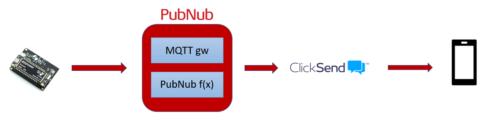
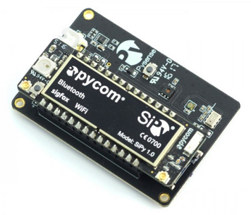
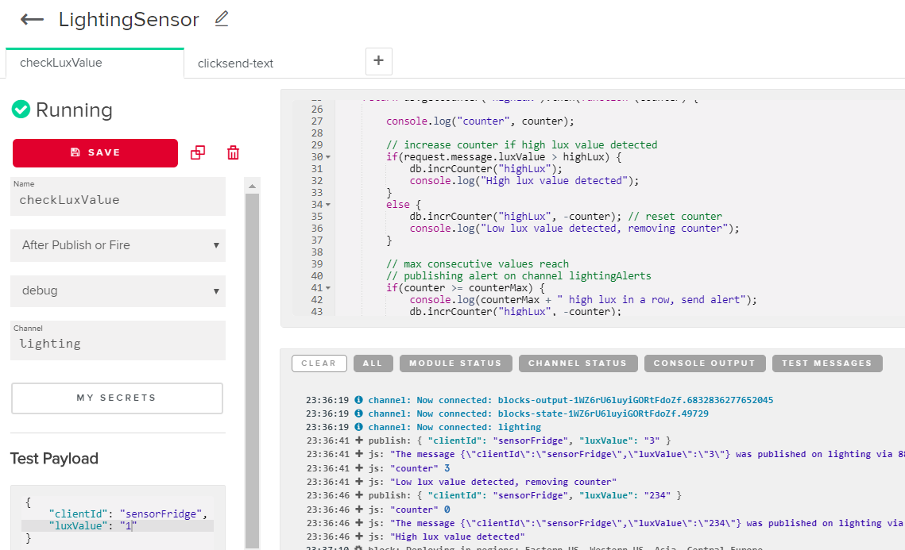
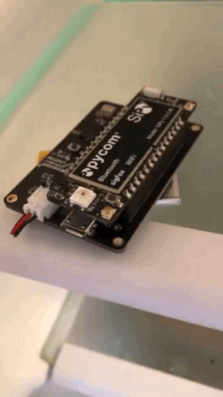
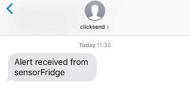

# Building a light monitoring system using PubNub and Pycom board

Light sensors can be used in various IOT applications: in smart cities to optimize street lighting, in home automation to control ambient light, or in safety related use cases to detect an opened door.

In this project, we will focus on cold chain monitoring, specifically refrigerator opening detection for energy saving. The goal is to alert users by text message if door stays opened for too long.

## How it works

[PubNub](https://www.pubnub.com) is a great fit to enable realtime communication for IOT devices and quickly deploy applications to trigger actions.

Our sensor will measure and send light information (in lux) every minute to PubNub MQTT gateway. PubNub function will then be used to compare the value to assess an opened door (we consider a closed fridge as emitting no light). After 5 consecutive positive measurements, a message will be pushed to an alert channel and also by text message through [ClickSend service](https://www.clicksend.com).

Our device is based on the [Pycom SiPy](https://pycom.io/product/sipy/) and [pysense](https://pycom.io/product/pysense/) boards. Pycom provides hardware to accelerate IOT development using multiple connectivity technologies like LoRa, Sigfox, WiFi or NB-IOT.

The SiPy embeds an ESP32 micro-controller supporting Wi-Fi and Bluetooth as well as a Sigfox chipset. The Pysense is an extension board with several sensors: temperature, humidity, light, barometric and accelerometer.

## Building the device

Rename first the file `config.json.example` to `config.json` and enter your wifi SSID information and PubNub publish key.

You can then transfer the content of directory `pycom` to your board. If this is your first time using the board, you can follow Pycom tutorial to [install their Pymakr plugin](https://docs.pycom.io/pymakr/installation/).

The board will blink green once connected to the wifi, and red when sending a measurement.

Libraries in the folder lib/ are coming from [pycom repository](https://github.com/pycom/pycom-libraries).

## PubNub function

Connect to your PubNub admin interface and create a new module.

We can then create a new function that will execute `after publish` on channel `lighting`, content of the function is in file checkLuxValue.js.

The function will publish to channel `lightingAlerts` once the lux threshold has been reached 5 times in a row (10 lux considered as low light environment). PubNub fire() could also have been used but publishing on a channel is also relevant for subscribers not receiving SMS.

Second function of the module also execute after publish but on channel `lightingAlerts`. It retrieves the  clientId and sends a text message to the registered phone number.
Content of the function is in file clicksendText.js. Enter your clicksend api key and phone number to complete it. You can create a free account on [ClickSend](https://www.clicksend.com).

## Demo

Below is a simple demo of the device connecting to wifi and sending MQTT message:

And the received SMS after 5 positive measurements:

